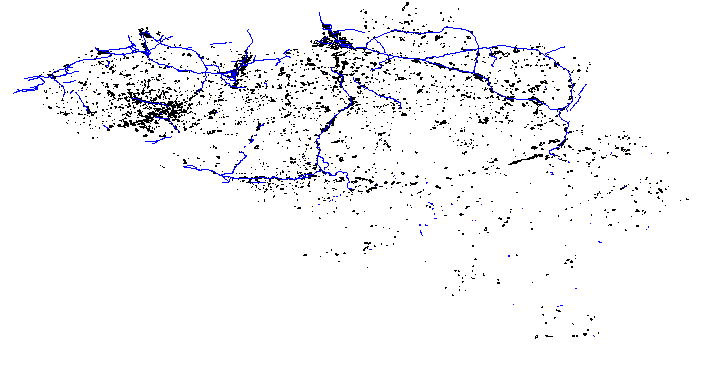

# BelgiumMaps: Maps about Belgium

This suite of R package allows R users to easily have data available containing geographical information about Belgium. It contains data available as part of OpenStreetMap (https://www.openstreetmap.org), functions to extract and recode data of the Global Administrative Area (http://gadm.org) as well as data available as part of the  Atlas Numérique de Belgique (UCL: http://www.atlas-belgique.be/cms/index.php?page=fonds)

## Packages

There are 3 packages available in this part of the repository

1. **BelgiumMapsOpenStreetMap**: released under the Open Database License 1.0. http://opendatacommons.org/licenses/odbl/1-0/. You may use the data for any purpose, but you have to acknowledge OpenStreetMap as the data source.

2. **BelgiumMapsGADM**: maps only available for academic use and other non-commercial use (Under construction)

3. **BelgiumMapsAtlas**: maps only available for academic use and other non-commercial use (Under construction)

## Installation

The R packages are currently only available through github. There are no plans to put these packages on CRAN as the data are too big for the CRAN policy and the text of the spatial data is available in UTF-8 instead of ASCII (which is the preferred encoding at CRAN).


To install the latest version from github:
```
install.packages('devtools')
devtools::install_github("jwijffels/StatisticsBelgium", subdir = "BelgiumMaps/BelgiumMapsOpenStreetMap")
```
The package size of BelgiumMapsOpenStreetMap is approximately 140Mb so this takes some time to install.

## Documentation of the BelgiumMapsOpenStreetMap package

This package contains data extracted from http://download.geofabrik.de/europe/belgium.html on 2015/11/03 with OpenStreetMap data up to 2015-11-02T22:22:02Z.

### Administrative boundaries

The belgium-latest.osm.pbf file was imported with osm2pgsql in PostGIS and converted to a shapefile with pgsql2shp to obtain shape files of polygons of administrative boundaries of administrative levels 2, 4, 6, 7, 8, 9. More information about administrative levels in OpenStreetMap: http://wiki.openstreetmap.org/wiki/Tag:boundary%3Dadministrative.
These administrative boundaries are made available in the BE_OSM_ADMIN dataset inside the package.

```
library(BelgiumMapsOpenStreetMap)
library(sp)
data(BE_OSM_ADMIN) 
plot(BE_OSM_ADMIN)
str(as.data.frame(BE_OSM_ADMIN))
```

The BE_OSM_ADMIN spatial data contains NIS codes which where extracted from the ref:INS tag of the OpenStreetmap polygon. These can be used to link with the BelgiumStatistics NIS code identifier which is present in the data of the BelgiumStatistics package. Example shown below.

```
library(BelgiumStatistics)
library(BelgiumMapsOpenStreetMap)
library(data.table)
library(leaflet)

data(TF_SOC_POP_STRUCT_2015, package = "BelgiumMapsOpenStreetMap")
data(TF_SOC_POP_STRUCT_2015, package = "BelgiumStatistics")

x <- as.data.table(TF_SOC_POP_STRUCT_2015)
x <- x[, list(MS_POPULATION = sum(MS_POPULATION),
              Females = 100 * sum(MS_POPULATION[CD_SEX == "F"]) / sum(MS_POPULATION)),
       by = list(CD_MUNTY_REFNIS, TX_MUNTY_DESCR_NL, TX_MUNTY_DESCR_FR)]

mymap <- subset(BE_OSM_ADMIN, !is.na(TAG.ref.INS))
myenrichedmap <- merge(mymap, x, by.x = "TAG.ref.INS", by.y = "CD_MUNTY_REFNIS", all.x=TRUE, all.y=FALSE)
myenrichedmap <- subset(myenrichedmap, !is.na(Females))
pal <- colorNumeric(palette = "Blues", domain = myenrichedmap$Females)
leaflet(myenrichedmap) %>%
  addTiles() %>%
  addPolygons(stroke = FALSE, smoothFactor = 0.2, fillOpacity = 0.85, color = ~pal(Females)) %>%
  addPopups(lng = 4.366354, lat = 50.86619, popup="BNOSAC offices<br/>www.bnosac.be")
```


### Other data

Next to the administrative boundaries which were created in PostGIS, the shapefiles provided by Geofabrik in the file http://download.geofabrik.de/europe/belgium-latest.shp.zip are also made available in the package.
This includes data of landuse, natural, places, points, railways, roads and waterways.

```
library(BelgiumMapsOpenStreetMap)
library(sp)
data(BE_OSM_PLACES)
data(BE_OSM_POINTS)
data(BE_OSM_RAILWAYS)
data(BE_OSM_ROADS)
data(BE_OSM_WATERWAYS)
plot(BE_OSM_RAILWAYS)
plot(BE_OSM_WATERWAYS)
str(as.data.frame(BE_OSM_LANDUSE))
plot(subset(BE_OSM_ROADS, type %in% c("motorway", "primary")))
str(as.data.frame(BE_OSM_ROADS))
plot(subset(BE_OSM_LANDUSE, type == "industrial"))
lines(subset(BE_OSM_WATERWAYS, type %in% c("canal")), col = "blue")
plot(subset(BE_OSM_LANDUSE, type == "farmland"))
```


More information about the content of these files can be found in the **inst/docs** folder

