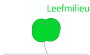

# StatisticsBelgium

This R package allows R users to easily work with the data made available by the 'Algemene Directie Statistiek - Statistics Belgium', data which is part of the Open Data initiative of the Belgium government (initiative started on 22/10/2015).

It packages the data available at http://statbel.fgov.be/nl/statistieken/opendata/home

The data is made available under the 'Licentie open data' which is compatible with the Creative Commons Attribution 2.0 license https://creativecommons.org/licenses/by/2.0


## Data
The data of StatisticsBelgium covers the topics 'Population', 'Work/Fiscal information', 'Kadaster' and the 'Census of 2011'





The data are collected on 27/10/2015 from the website of http://statbel.fgov.be/nl/statistieken/opendata/home and packaged as an R package.


## Installation

The R package is currently only available through github. There are no plans to put these packages on CRAN as the data are too big for the CRAN policy and the text is available in UTF-8 instead of ASCII (which is the preferred encoding at CRAN).


To install the latest version from github:
```
install.packages('devtools')
devtools::install_github("jwijffels/StatisticsBelgium", subdir = "BelgiumStatistics")
```


## Documentation of the data sources
The following shows how the data can be accessed and points to documentation of the different datasets. There are 5 main data groups.

### Bevolking
There are 9 datasets available regarding the population. Basically deaths, newborns, population statistics for 2009 up to 2015. 
More information: http://statbel.fgov.be/nl/statistieken/cijfers/arbeid_leven/fisc/index.jsp.
Detailed information about the content of the data can also be found in the **inst/docs/bevolking** folder of the package.
```
library(BelgiumStatistics)
data(TF_BIRTHS) 
data(TF_DEATHS) 
data(TF_SOC_POP_STRUCT_2015) 
data(TF_SOC_POP_STRUCT_2014)
data(TF_SOC_POP_STRUCT_2013) 
data(TF_SOC_POP_STRUCT_2012) 
data(TF_SOC_POP_STRUCT_2011) 
data(TF_SOC_POP_STRUCT_2010) 
data(TF_SOC_POP_STRUCT_2019) 
```

### Werk
There is 1 dataset available regarding fiscal revenues. 
More information: http://statbel.fgov.be/nl/statistieken/cijfers/arbeid_leven/fisc/index.jsp
Detailed information about the content of the data can also be found in the **inst/docs/werk** folder of the package.
```
library(BelgiumStatistics)
data(TF_PSNL_INC_TAX_MUNTY) 
```

### Leefmilieu
There are 30 datasets available regarding the land occupation. From the periods 1983 up to 2015. 
More information: http://statbel.fgov.be/nl/statistieken/cijfers/leefmilieu/geo/bodembezetting_kadaster/
Detailed information about the content of the data can also be found in the **inst/docs/leefmilieu** folder of the package.
```
library(BelgiumStatistics)
data(TF_EAE_LAND_OCCUPTN_2015) 
data(TF_EAE_LAND_OCCUPTN_2014) 
data(TF_EAE_LAND_OCCUPTN_2013) 
data(TF_EAE_LAND_OCCUPTN_2012) 
data(TF_EAE_LAND_OCCUPTN_2011) 
data(TF_EAE_LAND_OCCUPTN_2010) 
data(TF_EAE_LAND_OCCUPTN_2009) 
data(TF_EAE_LAND_OCCUPTN_2008) 
data(TF_EAE_LAND_OCCUPTN_2007) 
data(TF_EAE_LAND_OCCUPTN_2005) 
data(TF_EAE_LAND_OCCUPTN_2004) 
data(TF_EAE_LAND_OCCUPTN_2002) 
data(TF_EAE_LAND_OCCUPTN_2001) 
data(TF_EAE_LAND_OCCUPTN_2000) 
data(TF_EAE_LAND_OCCUPTN_1999) 
data(TF_EAE_LAND_OCCUPTN_1998) 
data(TF_EAE_LAND_OCCUPTN_1997) 
data(TF_EAE_LAND_OCCUPTN_1996) 
data(TF_EAE_LAND_OCCUPTN_1995) 
data(TF_EAE_LAND_OCCUPTN_1994) 
data(TF_EAE_LAND_OCCUPTN_1993) 
data(TF_EAE_LAND_OCCUPTN_1991) 
data(TF_EAE_LAND_OCCUPTN_1990) 
data(TF_EAE_LAND_OCCUPTN_1989) 
data(TF_EAE_LAND_OCCUPTN_1988) 
data(TF_EAE_LAND_OCCUPTN_1987) 
data(TF_EAE_LAND_OCCUPTN_1986) 
data(TF_EAE_LAND_OCCUPTN_1985) 
data(TF_EAE_LAND_OCCUPTN_1984) 
data(TF_EAE_LAND_OCCUPTN_1983) 
```


### Census 2011
There are 57 datasets available regarding the census in 2011. Grouped by different levels of aggregation.
More information: More information http://www.census2011.be/index_nl.html
Detailed information about the content of the data can also be found in the **inst/docs/census2011** folder of the package.
```
library(BelgiumStatistics)
data(TF_CENSUS_2011_HC01_L) 
data(TF_CENSUS_2011_HC02_L) 
data(TF_CENSUS_2011_HC03_L) 
data(TF_CENSUS_2011_HC04_L) 
data(TF_CENSUS_2011_HC06_L) 
data(TF_CENSUS_2011_HC07_L) 
data(TF_CENSUS_2011_HC08_L) 
data(TF_CENSUS_2011_HC09_L) 
data(TF_CENSUS_2011_HC10_L) 
data(TF_CENSUS_2011_HC11_L) 
data(TF_CENSUS_2011_HC12_L) 
data(TF_CENSUS_2011_HC13_L) 
data(TF_CENSUS_2011_HC14_L) 
data(TF_CENSUS_2011_HC15_L) 
data(TF_CENSUS_2011_HC16_L) 
data(TF_CENSUS_2011_HC17_L) 
data(TF_CENSUS_2011_HC18_L) 
data(TF_CENSUS_2011_HC19_L) 
data(TF_CENSUS_2011_HC20_L) 
data(TF_CENSUS_2011_HC21_L) 
data(TF_CENSUS_2011_HC22_L) 
data(TF_CENSUS_2011_HC23_L) 
data(TF_CENSUS_2011_HC24_L) 
data(TF_CENSUS_2011_HC25_L) 
data(TF_CENSUS_2011_HC26_L) 
data(TF_CENSUS_2011_HC27_L) 
data(TF_CENSUS_2011_HC28_L) 
data(TF_CENSUS_2011_HC29_L) 
data(TF_CENSUS_2011_HC30_L) 
data(TF_CENSUS_2011_HC31_L) 
data(TF_CENSUS_2011_HC32_L) 
data(TF_CENSUS_2011_HC33_L) 
data(TF_CENSUS_2011_HC34_L) 
data(TF_CENSUS_2011_HC35_L) 
data(TF_CENSUS_2011_HC36_L) 
data(TF_CENSUS_2011_HC37_L) 
data(TF_CENSUS_2011_HC38_L) 
data(TF_CENSUS_2011_HC39_L) 
data(TF_CENSUS_2011_HC40_L) 
data(TF_CENSUS_2011_HC41_L) 
data(TF_CENSUS_2011_HC42_L) 
data(TF_CENSUS_2011_HC43_L) 
data(TF_CENSUS_2011_HC44_L) 
data(TF_CENSUS_2011_HC45_L) 
data(TF_CENSUS_2011_HC46_L) 
data(TF_CENSUS_2011_HC47_L) 
data(TF_CENSUS_2011_HC48_L) 
data(TF_CENSUS_2011_HC50_L) 
data(TF_CENSUS_2011_HC51_L) 
data(TF_CENSUS_2011_HC52_L) 
data(TF_CENSUS_2011_HC53_L) 
data(TF_CENSUS_2011_HC54_L) 
data(TF_CENSUS_2011_HC55_L) 
data(TF_CENSUS_2011_HC56_L) 
data(TF_CENSUS_2011_HC58_L) 
data(TF_CENSUS_2011_HC59_L) 
data(TF_CENSUS_2011_HC60_L) 
```


### Tools
There is 1 dataset available regarding codes of occupations. 
More information: http://www.ilo.org/public/english/bureau/stat/isco/index.htm
Detailed information about the content of the data can also be found in the **inst/docs/tools** folder of the package.
```
library(BelgiumStatistics)
data(TU_ISCO_2008)
```

